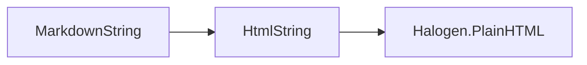

## TODO

- [ ] Review the source code / git log.
    - to get a sense of what I was doing last time.
- [ ] Implement the transformer from Markdown to HTML in IO
    - [x] Implement the FFI to transform Markdown to HTML
    - [ ] Implement the Halogen component to show Markdown content
- [ ] Set up a pipeline for content submit Markdown files to Firebase
- [ ] Set up IO functions to
    - [ ] retrieve content from Firebase URL, and
    - [ ] show in Markdown componenent

